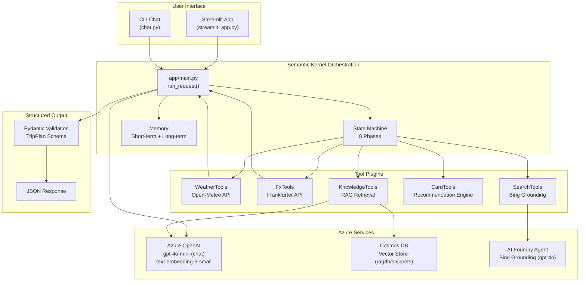
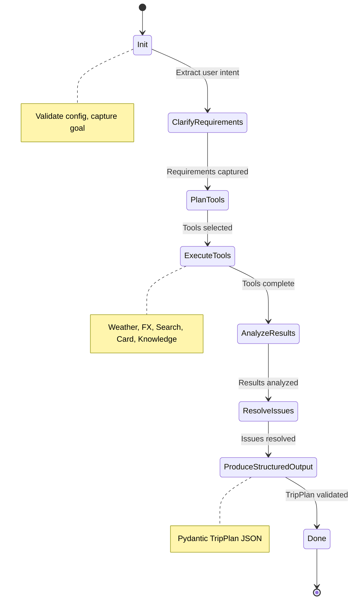
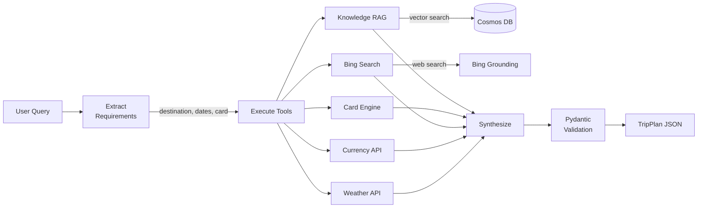

# Travel Concierge Agent

AI Travel Concierge Agent for Banking International premium credit card customers. This intelligent agent helps customers plan trips from start to finish using Microsoft Semantic Kernel, Azure OpenAI, and Cosmos DB for vector RAG.

**Project**: Udacity AI Agents with Azure Foundry - Project 3

## Architecture

### System Overview



### Agent State Machine



### Data Flow



### Component Summary

| Component | Technology | Purpose |
|-----------|-----------|---------|
| Orchestration | Semantic Kernel 1.36.1 | Agent workflow and tool coordination |
| Chat LLM | Azure OpenAI gpt-4o-mini | Primary chat model for agent reasoning |
| Agent LLM | Azure OpenAI gpt-4o | Bing Grounding agent (requires gpt-4o) |
| Embeddings | text-embedding-3-small | Vector embeddings for RAG (1536 dims) |
| Vector Store | Azure Cosmos DB | Knowledge storage with vector search |
| Web Search | Bing Grounding (AI Foundry) | Real-time travel information |
| Validation | Pydantic 2.11.7 | Structured output validation (TripPlan) |
| UI | Streamlit | Interactive web interface |

## Quick Start

### Prerequisites

- Python 3.12+
- Azure OpenAI service with:
  - gpt-4o-mini deployment (chat)
  - gpt-4o deployment (Bing Grounding agent)
  - text-embedding-3-small deployment (embeddings)
- Azure Cosmos DB account with vector search enabled
- Azure AI Foundry project with Bing Grounding

### Installation

```bash
# Create and activate virtual environment
python -m venv .venv
.venv\Scripts\activate  # Windows
# source .venv/bin/activate  # Linux/Mac

# Install dependencies
pip install -r requirements.txt

# Configure environment
cp env.example .env
# Edit .env with your Azure credentials
```

### Usage

**Streamlit UI (Recommended)**
```bash
streamlit run streamlit_app.py
```

**Chat CLI**
```bash
python chat.py
```

**Programmatic Usage**
```python
import asyncio
from app.main import run_request
import json

result = asyncio.run(run_request("Plan a trip to Paris from June 1-8 with my BankGold card"))
plan_data = json.loads(result)
print(plan_data["plan"]["destination"])
```

## Development

### Testing

```bash
# Run all unit tests
python -m pytest tests/ -v

# Run specific test categories
python -m pytest tests/test_models.py -v      # Data models
python -m pytest tests/test_tools.py -v       # Tool functionality
python -m pytest tests/test_state.py -v       # State management
python -m pytest tests/test_memory.py -v      # Memory systems

# System health check
python app/scripts/system_check.py
```

### Project Structure

```
app/
    main.py              # Main entry point with Semantic Kernel
    models.py            # Pydantic schemas (TripPlan, Weather, etc.)
    synthesis.py         # AI synthesis and JSON generation
    state.py             # 8-phase agent state machine
    memory.py            # Short-term memory system
    long_term_memory.py  # Long-term memory with Cosmos DB
    tools/               # Tool implementations
        weather.py       # Open-Meteo weather API
        fx.py            # Frankfurter currency API
        search.py        # Bing Search integration
        card.py          # Card recommendation engine
        knowledge.py     # RAG knowledge retrieval
    rag/                 # Vector RAG system
        ingest.py        # Data ingestion
        retriever.py     # Vector search
    eval/                # Evaluation harness
        judge.py         # Rule-based evaluation
        llm_judge.py     # LLM-based evaluation
    scripts/             # Utility scripts
        system_check.py  # Health check script
    utils/               # Utility modules
        config.py        # Configuration management
        logger.py        # Logging setup
tests/                   # Unit tests (76 tests)
chat.py                  # CLI chat interface
streamlit_app.py         # Streamlit web UI
```

## Documentation

- [app/README.md](app/README.md) - Technical reference with API docs
- [DEVELOPMENT_GUIDE.md](DEVELOPMENT_GUIDE.md) - Step-by-step development guide

## Status

**Implementation Complete:**
- [x] 8-phase state machine
- [x] Short-term and long-term memory
- [x] Weather, FX, Card, Knowledge, Search tools
- [x] RAG with Cosmos DB vector search
- [x] Pydantic data models
- [x] Unit tests (76 passing)
- [x] Azure OpenAI integration (gpt-4o-mini chat, gpt-4o agent)
- [x] Cosmos DB vector search
- [x] AI Foundry Agent with Bing Grounding
- [x] LLM-as-Judge evaluation (3.63/5.00)
- [x] Streamlit web UI

**Azure Resources:**
- Azure AI Services: `udacity-travel-aoai-475` (West US)
- Cosmos DB: `udacity-travel-db-475` (West US, serverless)
- AI Foundry Hub: `udacity-travel-hub`
- AI Foundry Project: `udacity-travel-aoai-project`
- Bing Grounding: `bing-grounding` (Active)